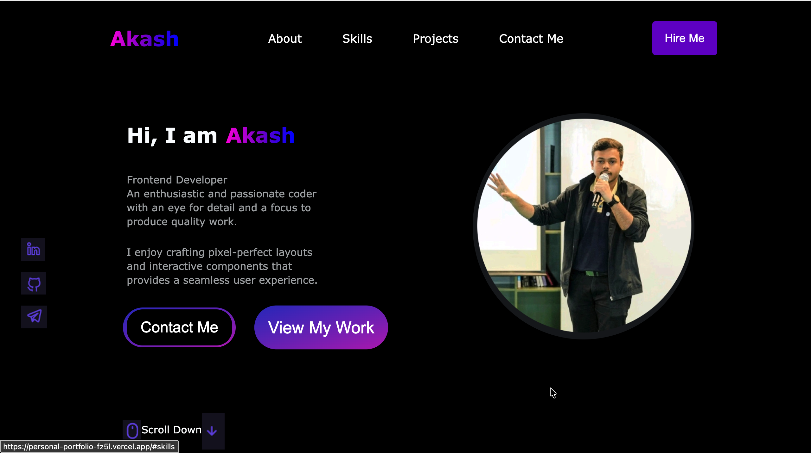
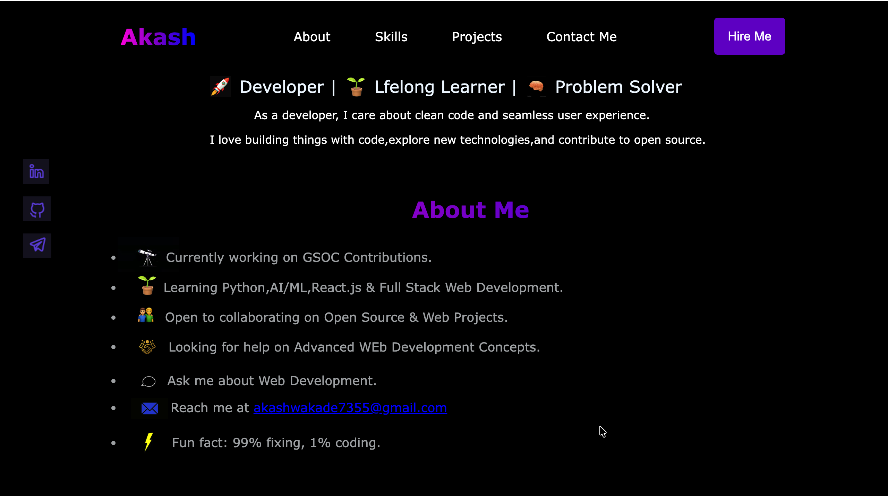
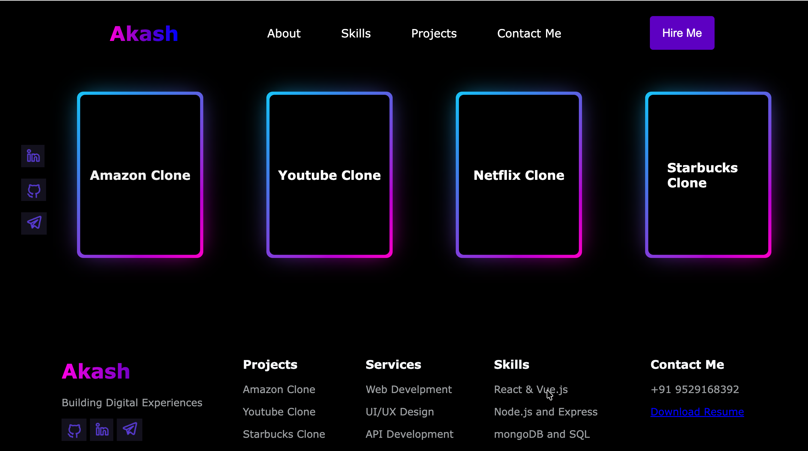

# 🌐 Personal Portfolio Website

A modern and responsive **personal portfolio website** built using **HTML and CSS** to showcase my projects, skills, and web development journey.

Designed with a focus on **clean UI, smooth layout, and strong visual hierarchy** to create a professional online presence.

---

## 🚀 Live Demo

🔗 **View Website:**

## https://personal-portfolio-fz5l.vercel.app/

## 📸 Preview

### 🏠 Hero Section

<p align="center">
  <br>
</p>

### 👨‍💻 About & Skills

<p align="center">
  <br>
</p>

### 🚀 Projects Section

<p align="center">
  <br>
</p>

---

## ✨ Features

✅ Fully Responsive Design  
✅ Modern Dark UI  
✅ Smooth Navigation  
✅ Project Showcase Section  
✅ Social Media Integration  
✅ Clean Typography  
✅ Beginner-Friendly Code Structure

---

## 🛠️ Built With

- **HTML5** — Semantic and accessible structure
- **CSS3** — Modern styling and layout
- **Flexbox** — Responsive alignment
- **Google Fonts** — Clean typography

---

## 📂 Project Structure

```
portfolio/
│
├── index.html
├── style.css
│
└── images/
    ├── preview-1.png
    ├── preview-2.png
    ├── preview-3.png
    ├── main-image.png
    ├── Github.png
    ├── Linden.png
    ├── Telegram.png
    ├── Collaboration.png
    ├── scroll.png
    └── down.png
```

---

## 🎯 Purpose of This Project

This portfolio was created to:

- Showcase my web development skills
- Build a strong developer presence
- Practice real-world frontend design
- Deploy and manage a live project

---

## 💡 What I Learned

- Writing cleaner HTML structure
- Creating responsive layouts
- Improving UI/UX design sense
- Organizing project assets professionally
- Deploying websites

---

## 🔮 Future Improvements

- Add JavaScript for interactivity
- Integrate animations
- Add a contact form
- Convert into a React portfolio
- Improve performance

---

## 🤝 Connect With Me

📧 Email: akashwakade7355@gmail.com<br>
💼 LinkedIn: https://www.linkedin.com/in/akash-wakade-08b8412b2/<br>
💻 GitHub: https://github.com/Akash-Wakade-7008-alt

---

## ⭐ Support

If you like this project, consider giving it a **star ⭐** — it helps and motivates me to build more!

---

### 👨‍💻 Author

**Akash Wakade**  
Frontend Developer | Lifelong Learner | Problem Solver
