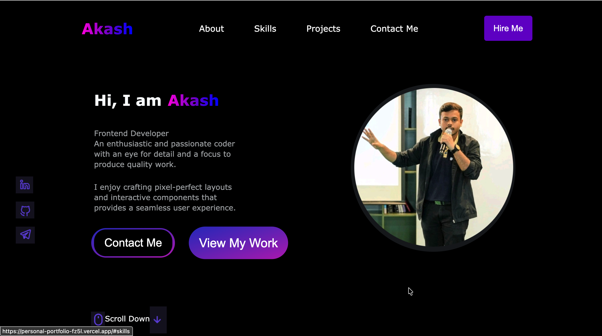
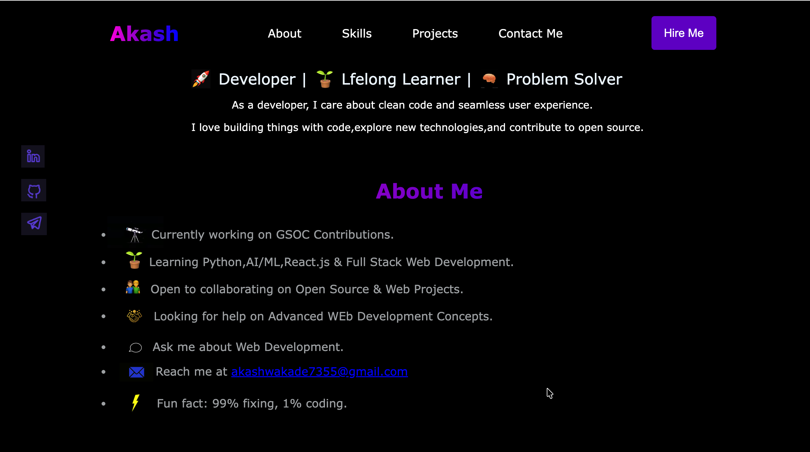
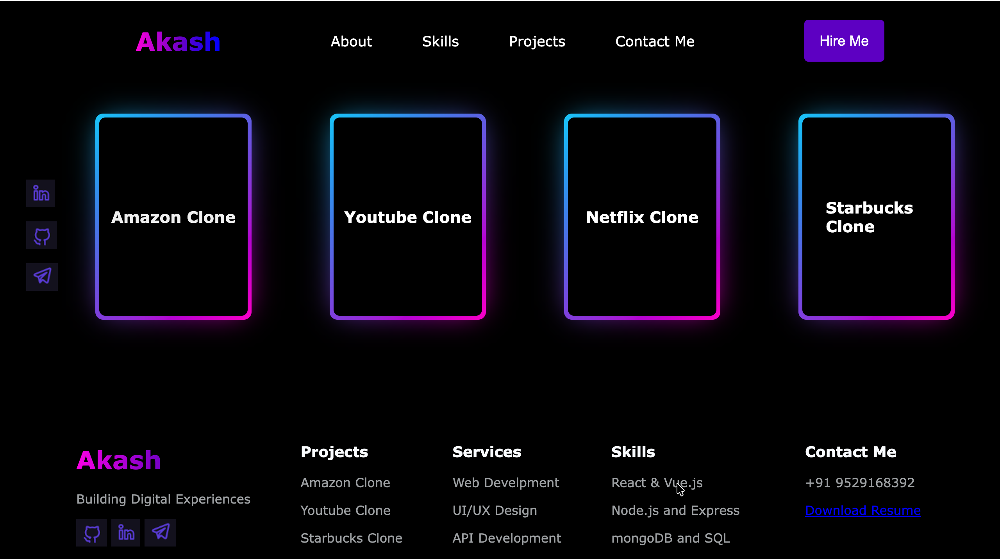

<p align="center">
  
</p>

<p align="center">
  
</p>

---

# 🌐 Personal Portfolio Website

> A modern, responsive **personal portfolio website** crafted using **HTML and CSS** to showcase my projects, skills, and journey as a web developer.

Designed with a strong focus on **clean UI, smooth layout, and professional visual hierarchy** to build a powerful online presence.

---

## 🚀 Live Demo

<p align="center">
  <a href="https://personal-portfolio-fz5l.vercel.app/" target="_blank">
    
  </a>
</p>

⭐ **Visit Here:**  
👉 https://personal-portfolio-396z.vercel.app/

---

## 📸 Preview

### 🏠 Hero Section

<p align="center">
  
</p>

### 👨‍💻 About & Skills

<p align="center">
  
</p>

### 🚀 Projects Section

<p align="center">
  
</p>

---

## ✨ Key Features

✅ Fully Responsive Layout  
✅ Modern Dark-Themed UI  
✅ Smooth Section Navigation  
✅ Dedicated Project Showcase  
✅ Social Media Integration  
✅ Clean Typography  
✅ Beginner-Friendly Structure  
✅ Fast Loading

---

## 📂 Project Structure

```
portfolio/
│
├── index.html
├── style.css
│
└── images/
    ├── preview-1.png
    ├── preview-2.png
    ├── preview-3.png
    ├── main-image.png
    ├── Github.png
    ├── Linden.png
    ├── Telegram.png
    ├── Collaboration.png
    ├── scroll.png
    └── down.png
```

---
## ⚙️ Local Setup

### Option 1: Clone the Repository

```bash
git clone https://github.com/Akash-Wakade-7008-alt/Personal_Portfolio.git

cd Personal_Portfolio

open index.html
```

### 📦 Option 2: Download ZIP

Download the project directly:  
👉 https://github.com/Akash-Wakade-7008-alt/Personal_Portfolio/releases/download/Personal_Portfoliov1.0/Personal_Portfolio.zip

1. Download the ZIP file  
2. Extract it  
3. Open `index.html` in your browser  

---


## 🎯 Purpose of This Project

This portfolio was built to:

✔ Showcase my development skills  
✔ Establish a strong online presence  
✔ Practice real-world frontend design  
✔ Deploy and manage a live website  
✔ Continuously improve as a developer

---

## 🧠 What I Learned

✅ Writing cleaner semantic HTML  
✅ Creating responsive layouts  
✅ Improving UI/UX design sense  
✅ Structuring production-ready projects  
✅ Asset organization  
✅ Deployment workflows

---

## 🔮 Future Enhancements

- Add JavaScript for interactivity
- Integrate advanced animations
- Build a functional contact form
- Upgrade to a React-based portfolio
- Improve Lighthouse performance score
- Add dark/light mode toggle

---

## 🤝 Connect With Me

<p align="center">
  <a href="mailto:akashwakade7355@gmail.com" style="text-decoration:none;">
    
  </a>
  <a href="https://www.linkedin.com/in/akash-wakade-08b8412b2/" style="text-decoration:none;">
    
  </a>
  <a href="https://github.com/Akash-Wakade-7008-alt" style="text-decoration:none;">
    
  </a>
</p>

---

## ⭐ Support

If you like this project, consider giving it a **STAR ⭐** — it motivates me to keep building and improving!

---

## 👨‍💻 Author

**Akash Wakade**

🚀 Frontend Developer  
💡 Lifelong Learner  
🔥 Passionate About Building Real-World Projects

---

## 👀 Visitor Counter

<p align="center">
  
</p>
